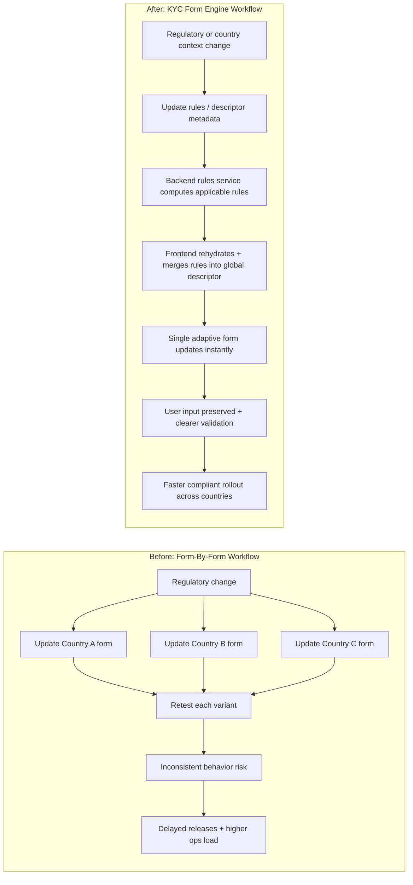
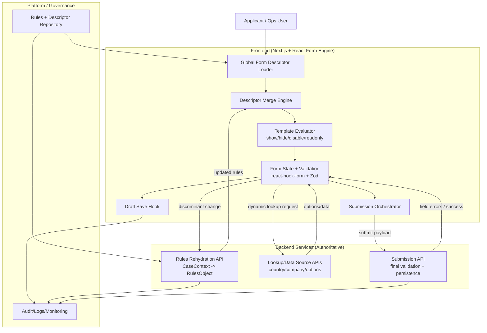

# KYC Form Engine Pitch Deck

## Interactive workshop for business + engineering teams

> Use this file as presentation slides.  
> Advance one section at a time (`---`) and run the interaction prompts live.

---

## Slide 1 - Title

# Stop Building KYC Forms.

# Start Building a KYC Engine.

**Subtitle:** A new way to solve future KYC complexity without rewriting forms every quarter.

**Facilitator prompt (30 sec):**

- "Today is not a product demo only. It is a mindset shift."
- "By the end, you should see your own KYC challenges solved by this engine."

---

## Slide 2 - Why We Are Here

### The current reality

- New country = new rules
- New rules = fragile form variants
- Fragile variants = delays, rework, risk, and applicant drop-off

### The core question

How do we stay compliant *and* fast when KYC requirements keep changing?

---

## Slide 3 - Audience Warm-Up (Interactive)

### Quick show of hands

- Who has seen a KYC rule change break a live flow?
- Who has seen duplicate form logic across countries?
- Who has seen users abandon due to confusing dynamic behavior?

### Transition line

"Perfect. Those pain points are exactly what this engine is built for."

---

## Slide 4 - Vision in One Sentence

We use a **metadata-driven form engine** where:

- the frontend stays fast and adaptive,
- the backend remains the compliance authority,
- and rules evolve without rebuilding entire UIs.

---

## Slide 5 - Before vs After

### Before (Form-By-Form Thinking)

- Country A form
- Country B form
- Country C form
- More branches, more drift, more maintenance

### After (Engine Thinking)

- One global descriptor
- Context-aware rule rehydration
- Dynamic merge of jurisdiction rules
- Same engine, many compliant outcomes

---

## Slide 5B - Before vs After Workflow Diagram

**Talk track (20 sec):**  
"Before, every change forks into many form variants. After, one rules update flows through one engine and instantly adapts behavior across contexts."

---

## Slide 6 - Product Experience Promise

### What users feel

- Responsive, modern form behavior
- Clear inline validation
- Inputs preserved when rules update
- Less confusion, fewer dead ends

### What the business gets

- Better conversion
- Lower ops escalations
- Faster adaptation to new requirements

---

## Slide 7 - How It Works (Simple View)

1. Render form from a global descriptor (blocks -> fields)
2. User changes discriminant data (country, process type, etc.)
3. Backend returns updated compliance rules
4. Rules merge into the descriptor in real time
5. Validation updates while preserving user input

**Key message:** one structure, context-specific behavior.

---

## Slide 7B - Global Architecture Diagram

### Narration (30-45 sec)
- The frontend renders a base descriptor and keeps UX fast with local evaluation and validation.
- When discriminants change (country/process), backend rules rehydration returns authoritative updates.
- The engine merges those rules into the active descriptor without losing user input.
- Data lookups and final submission stay backend-authoritative, with errors mapped back to fields.
- Monitoring and audit trails provide governance for compliance and operations.

---

## Slide 8 - Interactive Scenario Game

### "You are the rule owner"

Pick one scenario from the room:

- A new onboarding country is added next month
- A regulator changes ID format rules
- A process now requires signature in one jurisdiction only

### Ask the room

- "In our old model, what changes and how long would it take?"
- "With this engine model, what changes?"

**Target takeaway:** We change rules and descriptors, not whole screens.

---

## Slide 9 - Feature Showcase (Business + Technical)

### Engine capabilities

- Descriptor-driven rendering
- Dynamic status rules (show/hide/disable/readonly)
- Debounced backend rehydration for conflict resolution
- Draft auto-save and resume
- Dynamic data source loading
- Controlled submission orchestration (JSON + multipart, mapping backend errors to fields)

---

## Slide 10 - Trust and Compliance

### Security and governance model

- Backend is source of truth for final validation
- Frontend validations improve UX, not compliance authority
- Rule updates are centralized and auditable
- Fewer risky hotfixes in UI code

### Message for risk/compliance

This architecture reduces "wrong rule in wrong context" risk.

---

## Slide 11 - What This Means by Persona

### Business leaders

- Faster launch in new markets
- Better conversion and completion rates
- Lower cost of change

### Compliance and operations

- Consistent rule enforcement
- Better explainability of decisions
- Fewer manual interventions

### Engineers

- Less branching UI complexity
- Better separation of concerns
- Safer long-term maintainability

---

## Slide 12 - Real Demo Flow (Suggested)

1. Start with baseline KYC form
2. Enter data in several fields
3. Change jurisdiction discriminant
4. Show rule updates and preserved input
5. Submit and show backend-authoritative validation feedback

**Narration line:** "The form adapts without throwing away user progress."

---

## Slide 13 - Metrics We Should Track

### Business KPIs

- Form completion rate
- Time to onboard per case
- Drop-off by step

### Delivery KPIs

- Time to implement regulatory change
- Number of frontend variants removed
- Incidents related to rule mismatch

---

## Slide 14 - Adoption Roadmap

### Phase 1 - Pilot (1-2 high-value flows)

- Choose one multi-country KYC journey
- Baseline current pain and cycle time
- Measure impact after migration

### Phase 2 - Scale

- Expand descriptor coverage
- Standardize rule authoring workflows
- Institutionalize engine-first design reviews

### Phase 3 - Optimize

- Add advanced analytics and proactive rule simulation
- Increase self-service capability for domain teams

---

## Slide 15 - Objections and Answers

### "Is this too complex?"

It replaces hidden complexity (variant sprawl) with explicit, managed complexity.

### "Will performance suffer?"

Fast client loop + debounced backend loop keeps UX responsive.

### "Can frontend be bypassed?"

Backend re-validation remains authoritative by design.

---

## Slide 16 - Workshop Moment (Interactive)

### 5-minute team exercise

Ask each table/group to write:

- One current KYC pain point
- How they solve it today
- How engine-thinking could solve it better

### Debrief

Collect patterns and convert them into migration candidates.

---

## Slide 17 - The Ask

### Decision requested today

- Approve pilot scope
- Assign cross-functional squad (business + compliance + engineering)
- Align on success metrics and review cadence

### Why now

Regulations will keep changing.  
Engine-thinking turns that from a recurring crisis into a repeatable capability.

---

## Slide 18 - Closing

### Final message

We are not proposing "another KYC form project."  
We are proposing a **KYC capability platform**:

- adaptive,
- compliant,
- scalable,
- and designed for constant change.

**Closing line:**  
"If KYC complexity is inevitable, our advantage is how fast and safely we adapt."

---

## Appendix - Optional Technical Deep Dive

### Architecture highlights

- Next.js + React foundation
- Form state via `react-hook-form`
- Runtime validation with Zod schemas derived from merged rules
- Redux-backed orchestration and state management
- Rehydration pipeline: discriminants -> case context -> backend rules -> descriptor merge
- Draft persistence and controlled submit orchestration

### For technical Q&A

- Explain conflict-resolution strategy with concrete jurisdiction examples
- Show how backend field errors are mapped back to UI fields
- Discuss performance safeguards (debounce, targeted updates, no unnecessary rerenders)

