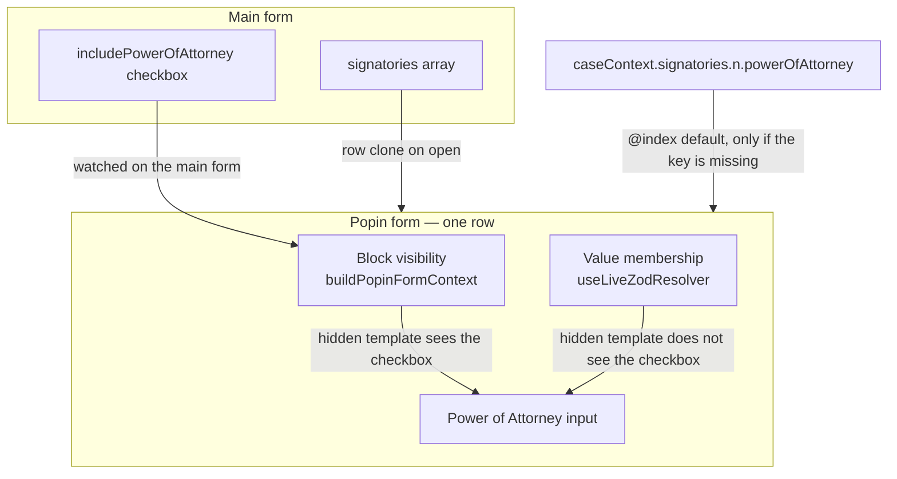
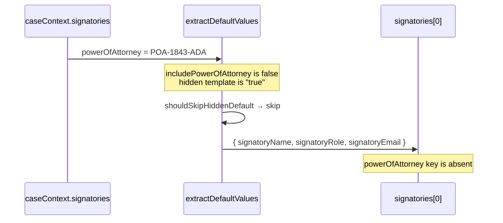
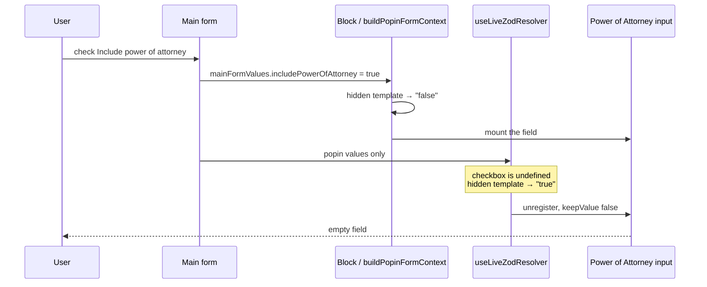

# Bug: Repeatable popin field hidden by a main-form checkbox loses its caseContext default

A repeatable popin field can take its default from the backend (`caseContext`) and stay hidden until a checkbox on the **main form** is checked. Two separate status evaluators run for that field. Only one of them can see the checkbox. The other treats the field as hidden, so the backend value is removed before the input is shown.

Demo that reproduces it: `/demo`, checkbox **Include power of attorney**, popin field **Power of Attorney** on Authorized Signatories. Prefill lives in `GET /api/demo/prefill` as `casePrefill.signatories[].powerOfAttorney`.

---

## What you see

1. The case already has signatories. Ada’s power of attorney is `POA-1843-ADA`.
2. **Include power of attorney** starts unchecked. The popin field is hidden. That part is correct.
3. Check the box and open an existing signatory.
4. **Power of Attorney** appears, but the input is empty. The backend value is gone.

A brand-new row (Add) can still show the field when the box is checked. It has no `@index` row to read, so it was never the failing case. The bug is an **existing row** whose default was computed while the field was hidden.

---

## The two contexts

The popin does not use one form. The main form keeps the repeatable array (`signatories`). The dialog mounts a second react-hook-form instance with only that row’s fields (`signatoryName`, `powerOfAttorney`, …). The checkbox `includePowerOfAttorney` exists only on the main form.



| Evaluator | Where | What it can see | Effect on Power of Attorney |
| --- | --- | --- | --- |
| UI status | `buildPopinFormContext` in `PopinFormSession` | Main-form values, then the popin row | Checkbox checked → render the input. Unchecked → render nothing. |
| Value membership | `useLiveZodResolver` → `buildFormContextFromValues` | Popin field values and `caseContext` only | Checkbox is absent, so the hidden template stays true and the value is unregistered. |

UI status and value membership answer different questions. UI status decides whether to paint the input. Membership decides whether the value is allowed to stay in the popin form. They must both see `includePowerOfAttorney`. Before the fix, only the UI path did.

---

## Step by step

### 1. The descriptor

The checkbox is a normal main-form field. The popin field’s default and visibility are templates:

```ts
{
  id: 'includePowerOfAttorney',
  type: 'checkbox',
  defaultValue: false,
}

{
  id: 'powerOfAttorney',
  defaultValue: '{{caseContext.signatories.@index.powerOfAttorney}}',
  status: {
    hidden: '{{#if includePowerOfAttorney}}false{{else}}true{{/if}}',
  },
}
```

`@index` is not a Handlebars variable. `bindTemplateIndex` rewrites it to the row number before compile, so row 0 reads `caseContext.signatories.0.powerOfAttorney`.

The hidden template follows the same checkbox pattern as the live resolver tests: output the string `"true"` or `"false"`. A bare `{{not includePowerOfAttorney}}` is unreliable here, because a Handlebars helper that returns boolean `false` prints an empty string, and an empty string is treated as “not hidden”.

### 2. Initial defaults drop the hidden key

`extractDefaultValues` walks each signatory from `repeatableDefaultSource: 'signatories'`. For every field it calls `shouldSkipHiddenDefault`.

At that moment the checkbox is still false (or missing). The hidden template evaluates to `"true"`. The field is skipped. The row is stored **without** `powerOfAttorney`, even though `caseContext` has the value.



This skip is intentional for fields hidden by **the same row** (a residential address must not keep `companyName`). It is the wrong outcome for a field hidden by a **main-form** checkbox: the value has to survive until the box is checked.

Sibling fields that are hidden for the same reason are omitted too. With no `entityType` and no `country` in the evaluation context, job title, ownership, and SSN are dropped at seed time. National ID stays, because its template hides only when `country` is `"US"`.

### 3. Opening the popin copies the incomplete row

`PopinFormSession` builds a flattened descriptor (base ids, no `signatories.` prefix) and a second form. For an existing row (`index >= 0`) it used to do:

```ts
popinForm.reset(instanceData);
```

`instanceData` is a clone of `signatories[0]`. The missing key is still missing. `reset` replaces whatever default the popin form had just computed. The `@index` template is not evaluated again.

Create mode (`index < 0`) is a different path. It evaluates defaults, then overlays `popinLoad`. Unbound `@index` (index is negative) returns the type default `''`. That is why **Add** never showed `POA-1843-ADA`.

### 4. The UI shows the field; membership deletes the value

`useWatch` on the main form feeds `buildPopinFormContext`. Spread order is main form first, popin row second, so a popin `country` still wins over the jurisdiction `country`. `includePowerOfAttorney` has no popin twin, so the checkbox value remains. `Block` evaluates `status.hidden` against that context and mounts the input when the box is checked.

In parallel, `useFormMembershipSync` calls `applyMembershipChanges`. That function builds context with `buildFormContextFromValues(popinValues, caseContext)`:

```ts
{
  ...popinValues,          // signatoryName, role, email — no checkbox
  caseContext,             // incorporation country, signatories, … — no checkbox
  formData: popinValues,
}
```

`includePowerOfAttorney` is `undefined`. `{{#if includePowerOfAttorney}}` takes the else branch. The template result is `"true"`. Membership classifies `powerOfAttorney` as hidden.

If the key is present, membership:

1. Stashes the current value.
2. `unregister`s the field with `keepValue: false`.

The stash is restored only when membership later decides the field became visible. Membership never sees the checkbox change, so the field never becomes visible **to membership**. The stash is never applied. The input mounts from the UI path with an empty value.



Checking the box **before** opening the popin fails the same way. The row never received the key at seed time, `reset` does not re-read `caseContext`, and membership would strip the value if something else wrote it.

Checking the box **while the popin is already open** fails for the membership reason alone. The UI would show the control; the value would already have been unregistered.

---

## How it is fixed

### Keep an explicit default on the row

`shouldSkipHiddenDefault` still omits a hidden field that has no `defaultValue`. That is how a residential address avoids copying `companyName`. A field that declares `defaultValue` is evaluated and stored anyway, including `{{caseContext.signatories.@index.powerOfAttorney}}` while the checkbox is off.

`useFormDescriptor` merges that default under the saved row. A key the row already has wins. A missing key stays on the default. The popin edit path does not `reset` over that merge.

Submit and popin Validate still drop the key while it is hidden, via `omitStatusHiddenFormValues`.

### Let membership see the main form

`PopinFormSession` passes the watched main-form values into `useFormDescriptor` as `statusValues`. `useLiveZodResolver` merges them **under** the popin values:

```ts
{ ...statusValues, ...popinFormValues }
```

Popin keys still win on a name clash. `includePowerOfAttorney` now exists for `collectStatusHiddenFieldIds` and `collectValidationTargets`.

- Box unchecked, value present → membership stashes it and unregisters it. The UI hides the input. The value is kept in the stash.
- Box checked → the field is newly visible. Membership restores the stash, which is the caseContext default kept on the row.

`statusValues` is fingerprinted with `JSON.stringify` so a checkbox toggle rebuilds the membership callback. Typing in an unrelated main-form field also changes that fingerprint; if the visible set did not change and no hidden key is present, membership returns immediately.

---

## What is still true after the fix

- Hidden keys are still omitted from **submit** and from popin **Validate** by `omitStatusHiddenFormValues`. A power of attorney value is not posted while the checkbox is off.
- The explicit default stays on the initial `signatories` row while the checkbox is off. The input stays hidden until the box is checked.
- Create mode still does not bind `@index`. A new signatory does not inherit Ada’s or Alan’s power of attorney. `popinLoad` (`/api/demo/signatory-load`) fills role and email for a new row; it does not return `powerOfAttorney`.
- If the form mounts before `GET /api/demo/prefill` finishes, `useForm` has already taken its `defaultValues`. Later prefill updates `caseContext` and does not re-seed `signatories`. That is a separate initialization race; **Load backend addresses** updates context only.
