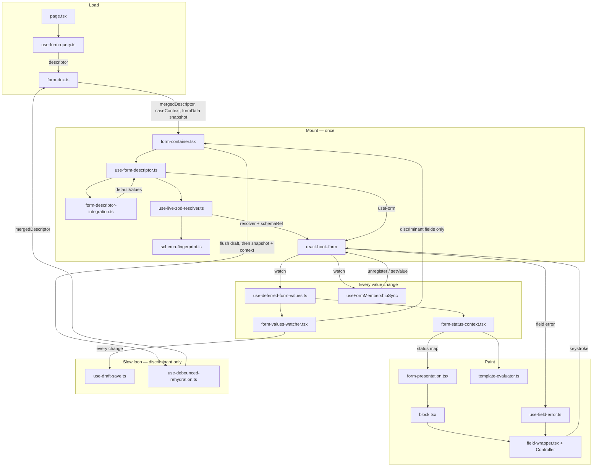
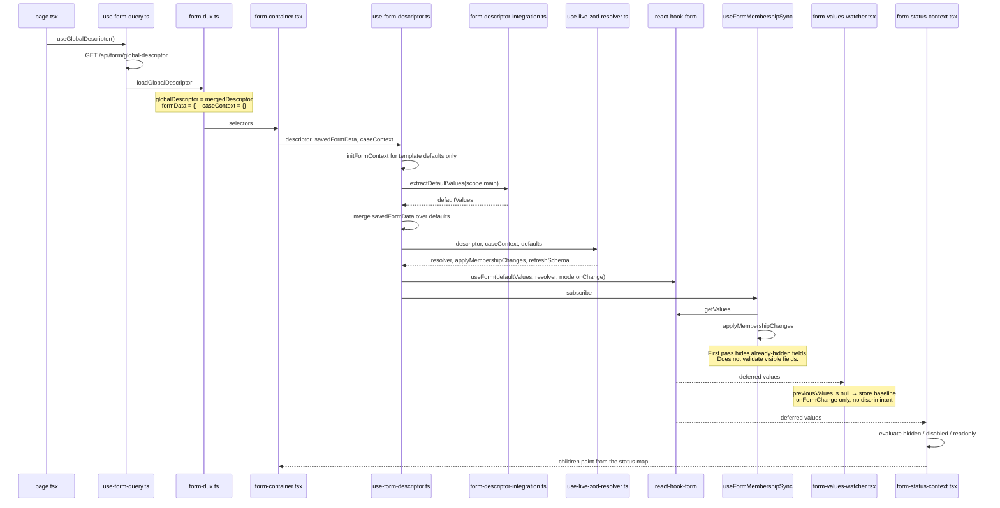
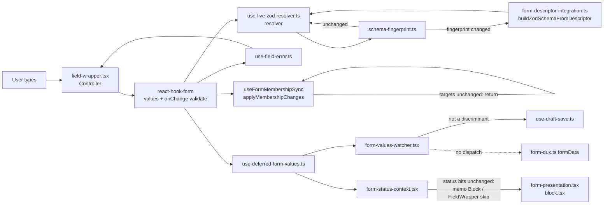
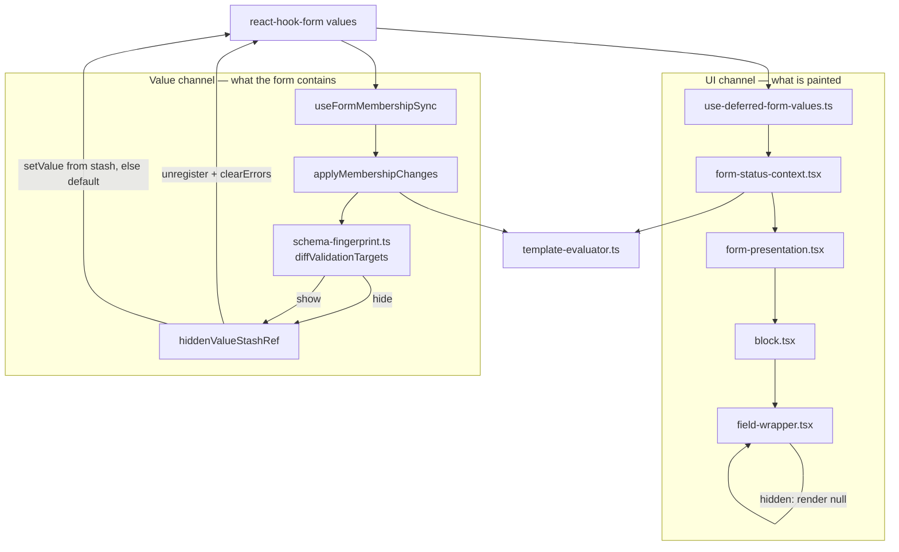
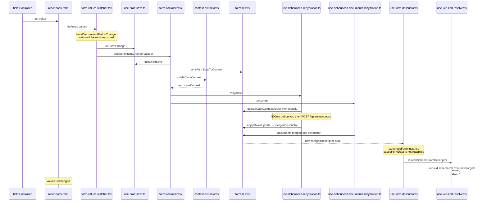
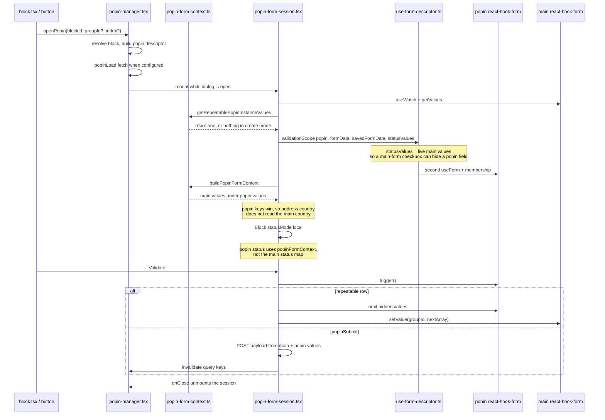
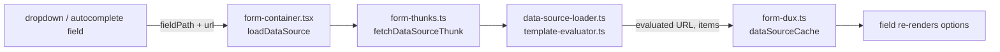

# Thin-Center Form Engine

This document is the **source of truth** for the form engine's performance-oriented architecture. It shows how data moves at runtime between files, from the first descriptor load through typing, hide/show, rehydration, and popins.

Older docs that describe `formKey` remounts or per-keystroke Redux `formData` mirroring are obsolete—see the [migration notes](#migration-from-remount-centric-docs) at the end. Hook internals live in [use-form-descriptor.md](./use-form-descriptor.md).

## Goals

- **RHF owns live values** — keystrokes stay in react-hook-form; Redux does not mirror every change.
- **Live Zod via `schemaRef`** — visibility and rule changes refresh validation without remounting the form.
- **Thin center** — `FormValuesWatcher` runs side effects only; presentation subscribes through `FormStatusProvider`, not a render-prop.
- **Popin sessions** — separate RHF instance mounted only while the dialog is open; `trigger()` before Validate/merge/POST.
- **Hide/show contract** — when `status.hidden` is true, fields are removed from values, schema, and errors; when shown again, the stashed or default value is restored. Rules sit in the schema and run on the next edit or an explicit submit.

## State ownership

| Concern | Owner | Notes |
|--------|--------|-------|
| Field values | react-hook-form | Authoritative during editing |
| Validation errors | react-hook-form | Per-field via `useFieldError` |
| Descriptor / merged rules | Redux | Updated by rehydration |
| `caseContext` | Redux | Discriminant fields only sync from RHF |
| `formData` snapshot | Redux | **Discriminant changes only** — not every keystroke |
| Data-source cache | Redux | Fetched URLs + template context from caller |
| UI visibility/disabled | `FormStatusProvider` | One deferred watch → status map |

`savedFormData` (the Redux `formData` snapshot) is read **once**, when `useForm` is created. Later snapshot updates do not reset the live form, because the form is not remounted.

## File roles

Read this table first. The diagrams below use these file names as the nodes.

| File | Role in the circulation |
|------|-------------------------|
| `src/app/page.tsx` | Mounts the page and calls `useGlobalDescriptor()` |
| `src/hooks/use-form-query.ts` | Fetches the global descriptor and dispatches it into Redux |
| `src/store/form-dux.ts` | Holds `mergedDescriptor`, `caseContext`, the discriminant `formData` snapshot, and `dataSourceCache` |
| `src/components/form-container.tsx` | Selects Redux state, creates the main form, and owns the discriminant callback |
| `src/hooks/use-form-descriptor.ts` | Builds mount defaults and the RHF instance. Does **not** talk to Redux |
| `src/utils/form-descriptor-integration.ts` | `extractDefaultValues` at mount; `buildZodSchemaFromDescriptor` whenever the schema is rebuilt |
| `src/hooks/use-live-zod-resolver.ts` | `schemaRef` clock, `applyMembershipChanges` (hide/show of **values**), `useFormMembershipSync` |
| `src/utils/schema-fingerprint.ts` | Which fields are validation targets, and the diff between the previous and next set. Walkthrough: [schema-fingerprint.md](./schema-fingerprint.md) |
| `src/utils/template-evaluator.ts` | Handlebars for defaults, hidden/disabled/readonly, and URLs |
| `src/hooks/use-deferred-form-values.ts` | `form.watch` deferred to a microtask, so subscribers do not update during `Controller` render |
| `src/components/form-values-watcher.tsx` | Effects only (renders `null`): draft on every change; discriminant callback only when a discriminant field changed |
| `src/hooks/use-draft-save.ts` | Debounced, dirty-field draft POST. `flushDraftSave` runs before rehydration |
| `src/context/form-status-context.tsx` | One status map (`hidden` / `disabled` / `readonly`) for blocks and fields. Does **not** change values |
| `src/components/form-presentation.tsx` | Reads block status from the map and renders `Block` |
| `src/components/block.tsx` | Reads field status (`statusMode="context"` on the main form) and renders fields |
| `src/components/field-wrapper.tsx` | Skips hidden fields; delegates to the typed field component |
| `src/hooks/use-field-error.ts` | One `useFormState` subscription per field |
| `src/hooks/use-debounced-rehydration.ts` | Writes `caseContext`, then POSTs rules after 500ms |
| `src/hooks/use-debounced-documents-rehydration.ts` | Same discriminant trigger, documents endpoint |
| `src/components/popin-manager.tsx` | Dialog shell. Mounts a popin session only while open |
| `src/components/popin-form-session.tsx` | Second RHF instance. Validate merges into the main form or POSTs `popinSubmit` |
| `src/utils/popin-form-context.ts` | Seeds a repeatable row and builds the popin Handlebars context |

Two different subscribers both hear value changes. They do different jobs:

- **`form-status-context.tsx`** decides what is painted.
- **`useFormMembershipSync`** decides what stays inside react-hook-form (values, schema, errors).

## Architecture overview

Data enters through Redux, becomes a react-hook-form instance inside `useFormDescriptor`, then fans out. The slow loop (rules) is the only path back into Redux `formData`.

## Scenario: initialization

The form exists only after Redux has a descriptor. `useFormDescriptor` turns that descriptor into defaults and a live resolver. Membership then strips fields that are already hidden. The watcher records a baseline and does not treat it as a user edit.

What each file contributes on this pass:

- **`use-form-query.ts`** is the only network call. Redux is empty until it returns.
- **`form-container.tsx`** passes the snapshot in as `savedFormData`. It does not create the form itself.
- **`use-form-descriptor.ts`** merges defaults and saved values, then calls `useForm` once.
- **`use-live-zod-resolver.ts`** holds `schemaRef`. The schema is rebuilt later in place; the `useForm` instance stays.
- **`useFormMembershipSync`** runs an immediate membership pass so hidden defaults never sit in `getValues()`.
- **`form-values-watcher.tsx`** stores the first values and stops. That observation is not a discriminant change.
- **`form-status-context.tsx`** builds the first status map from those same values plus `caseContext`.

## Scenario: ordinary keystroke

A non-discriminant edit stays in react-hook-form. Three listeners hear it. Redux `formData` is not one of them.

- **`use-field-error.ts`** re-renders only the field whose error changed.
- **`useFormMembershipSync`** compares validation targets. If the set is the same, it does nothing.
- **`form-values-watcher.tsx`** calls `onFormChange` → **`use-draft-save.ts`**. Draft save is debounced and skipped when the form is not dirty.
- **`form-status-context.tsx`** rebuilds the status map. Unchanged `hidden` / `disabled` / `readonly` objects are reused, so memoized blocks and fields skip render.
- **`form-dux.ts`** `formData` is untouched.

## Scenario: hide and show

Visibility is two channels that both read the new values. Neither channel calls the other.

Hide:

1. **`schema-fingerprint.ts`** marks the field absent from the next validation targets and present in status-hidden ids.
2. **`applyMembershipChanges`** stashes `getValues(fieldId)`, then `unregister` (drop the value) and `clearErrors`.
3. **`field-wrapper.tsx`** returns `null` because the status map says `hidden`.

Show:

1. The diff says the field is newly visible. The first pass at mount does **not** treat every visible field as newly shown.
2. **`applyMembershipChanges`** writes the stash, otherwise `defaultValuesByFieldId`, otherwise `''`.
3. It does not `trigger()` on show. Validation runs on the next user edit or an explicit submit.
4. The status map flips `hidden` to false, so the field mounts again and its `Controller` binds the restored value.

`refreshSchemaFromDescriptor` rebuilds `schemaRef` when the descriptor identity changes. The resolver also rebuilds `schemaRef` on the next validation if the fingerprint changed. Both paths keep the same `useForm` instance.

## Scenario: discriminant change

A discriminant field (country, process type, and anything flagged `isDiscriminant`) is the only edit that writes the Redux snapshot and asks the backend for new rules. Values already in react-hook-form stay there.

- **`form-values-watcher.tsx`** compares the previous and current values with `haveDiscriminantFieldsChanged`. Draft notification runs before the discriminant callback, in the same turn.
- **`form-container.tsx`** `handleDiscriminantChange` flushes the draft, writes the snapshot, derives context, then calls both rehydrate hooks.
- **`use-debounced-rehydration.ts`** updates `caseContext` in Redux immediately and POSTs rules after 500ms. A newer discriminant change cancels the pending POST.
- **`use-form-descriptor.ts`** receives the new descriptor as an argument. It does not call `useForm` again.
- **`useFormMembershipSync`** sees the new descriptor and calls `refreshSchemaFromDescriptor`.

## Scenario: popin

The dialog mounts a second form. The main form keeps running underneath. Closing the dialog unmounts the session.

- **`popin-manager.tsx`** owns open/close and the load request. It does not own field values.
- **`popin-form-session.tsx`** calls the same **`use-form-descriptor.ts`** with `validationScope: 'popin'`, so only popin blocks enter defaults and the Zod schema.
- **`statusValues`** is the live main-form watch. Membership on the popin form can hide a popin field because of a checkbox that lives on the main form.
- **`popin-form-context.ts`** overlays popin values on top of main values for templates inside the dialog.
- Validate always `trigger()`s the popin form first. A repeatable row is written back with `mainForm.setValue`. A `popinSubmit` block POSTs, then invalidates its query keys and the default `['form', 'data-source']` key.

## Scenario: data-source options

Dropdowns and autocompletes ask the container to load options. The field does not fetch by itself. The cache lives in Redux so a second field with the same URL can reuse it.

## Render isolation

These pieces keep a keystroke from re-rendering the whole tree:

- **`form-status-context.tsx`** — one deferred watch builds the block/field map and reuses status objects when the bits are unchanged.
- **`memo(Block)`**, **`memo(FieldWrapper)`** — skip re-render when status is unchanged.
- **`use-field-error.ts`** — per-field `useFormState`, instead of every field reading `form.formState.errors`.
- **Repeatable groups** — `form.watch(groupId)` once per group, not per row.
- **`use-deferred-form-values.ts`** — `FormValuesWatcher` and `FormStatusProvider` each subscribe here, so their `setState` runs after `Controller` render.

## Migration from remount-centric docs

The following documents described the old `formKey` / full-tree render-prop pattern. They should be read through this lens:

- `docs/form-dataflow.md` — overview still valid; ignore `formKey` and per-keystroke `formData` sections.
- `docs/architecture-redux-react-hook-form.md` — hybrid split still valid; remount is removed.
- `docs/form-initialization-data-flow.md` — init path unchanged; resolver is live after mount.
- `docs/handlebars-array-evaluation.md` — SSR `formKey` mismatch section is obsolete.
- `docs/integration-plan-react-redux-thunk.md` — data-source thunk accepts `templateContext` from caller.

## Success criteria

- Non-discriminant keystroke: no Redux `formData` dispatch, no remount, dependent status subscribers only.
- Discriminant change: values preserved; schema refreshes after rules merge.
- Hidden field: absent from `getValues()`, schema, and `formState.errors`.
- Shown field: present in values; its rules are in the schema and run on the next edit or submit.
