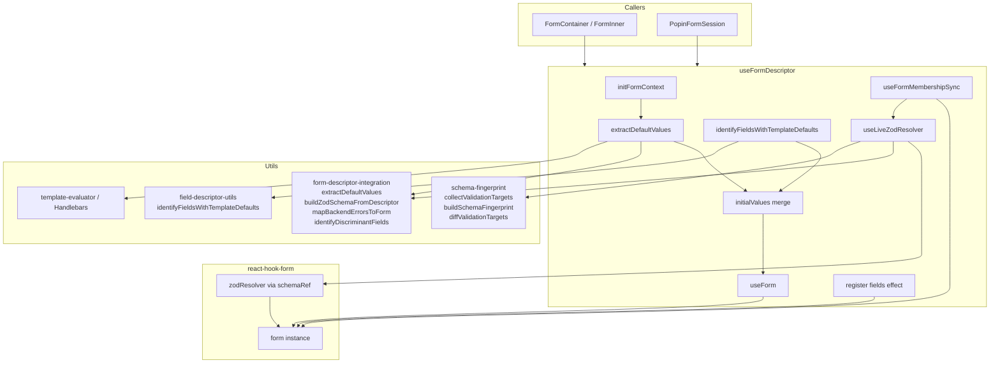
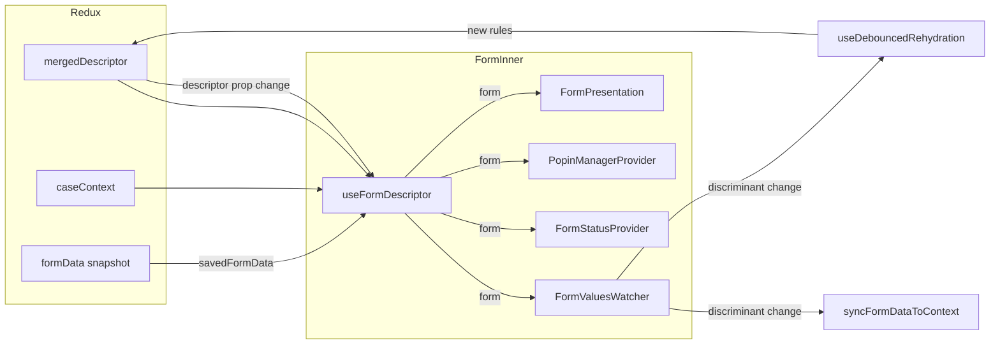
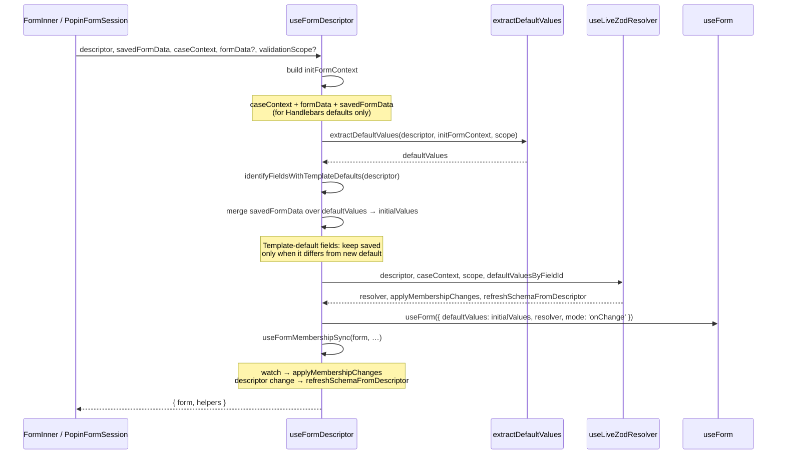
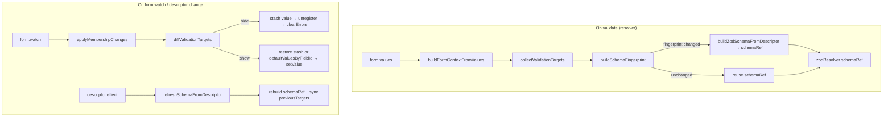
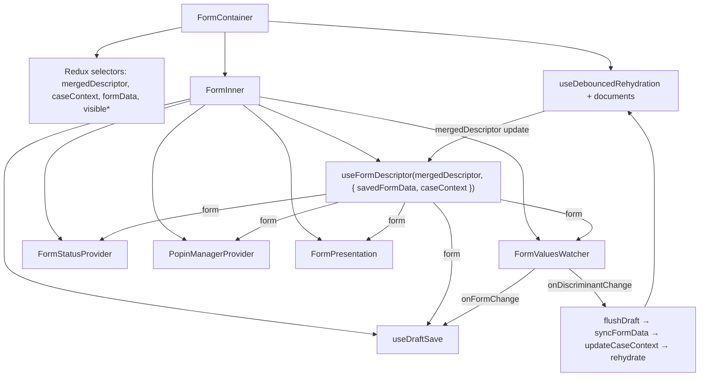
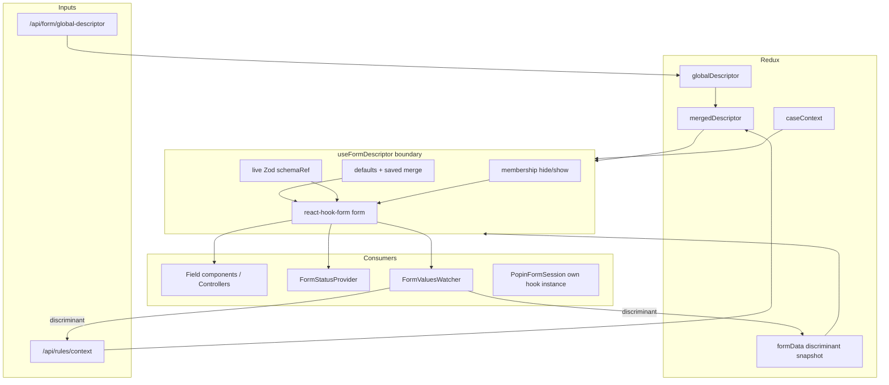

# `useFormDescriptor` — How It Works

This document explains the **`useFormDescriptor`** hook in detail: what it owns, how values and validation are initialized, how the live Zod resolver stays in sync without remounting, and how surrounding components (container, watcher, popin session) plug into it.

For the broader engine architecture, see [thin-center-form-engine.md](./thin-center-form-engine.md). For discriminant rehydration timing, see [debounced-rehydration.md](./debounced-rehydration.md).

---

## 1. Role in the engine

`useFormDescriptor` is the **bridge** between:

| Input | Role |
|-------|------|
| `GlobalFormDescriptor` (usually Redux `mergedDescriptor`) | Structure, defaults, validation rules, scopes |
| Options (`savedFormData`, `caseContext`, `formData`, `validationScope`) | Prefill + context for template defaults |
| **react-hook-form** | Authoritative live field values and errors |
| **`useLiveZodResolver`** | Schema that updates without remounting the form |

It does **not**:

- Talk to Redux directly
- Trigger rehydration / rules API calls
- Own UI visibility (that is `FormStatusProvider`)
- Mirror every keystroke anywhere outside RHF

Callers (`FormContainer` / `PopinFormSession`) own those concerns and receive a ready-to-use `form` instance plus helpers.

---

## 2. Public API

```ts
function useFormDescriptor(
  descriptor: GlobalFormDescriptor | null,
  options?: UseFormDescriptorOptions
): UseFormDescriptorReturn
```

### Options

| Option | Default | Purpose |
|--------|---------|---------|
| `savedFormData` | — | Previously saved / Redux snapshot values merged over defaults (state preservation) |
| `caseContext` | `{}` | Case/jurisdiction context for template defaults and live schema |
| `formData` | `{}` | Extra initial values for template evaluation at mount (e.g. main form values when opening a popin) |
| `validationScope` | `'main'` | `'main'` \| `'popin'` — which blocks/fields enter defaults + Zod schema |
| `onDiscriminantChange` | — | Declared on the options type; **not used inside the hook today**. Discriminant handling lives in `FormValuesWatcher` + `FormContainer`. |

### Return value

| Member | Purpose |
|--------|---------|
| `form` | `UseFormReturn` from `useForm` — the RHF instance |
| `registerField` / `unregisterField` | Tracks field IDs in a ref `Set` (legacy bookkeeping; membership is driven by the live resolver) |
| `updateValidationRules` | Forces `refreshSchemaFromDescriptor(form)` after an external descriptor update |
| `setBackendErrors` | Maps `{ field, message }[]` → `form.setError` |
| `getDiscriminantFields` | Returns field IDs with `isDiscriminant: true` from the descriptor |

---

## 3. Dependency map

### 3.1 What the hook composes



### 3.2 File-level dependency graph

```
use-form-descriptor.ts
├── react-hook-form          → useForm
├── use-live-zod-resolver.ts → resolver, membership, schema refresh
│   ├── @hookform/resolvers/zod
│   ├── form-descriptor-integration.ts  → buildZodSchemaFromDescriptor
│   └── schema-fingerprint.ts           → targets / fingerprint / hide-show diff
├── form-descriptor-integration.ts
│   ├── extractDefaultValues
│   ├── mapBackendErrorsToForm
│   └── identifyDiscriminantFields
└── field-descriptor-utils.ts
    └── identifyFieldsWithTemplateDefaults
```

### 3.3 Runtime collaborators (outside the hook)



The hook sits at the center of **form creation**. Rehydration, draft save, and UI status are siblings that consume `form`, not internals of the hook.

---

## 4. Initialization data flow (mount)

At mount, the hook turns descriptor + context into RHF `defaultValues`, then wires a live resolver.



### 4.1 `initFormContext`

Built once from options (memoized):

```ts
{
  caseContext,
  formData: { ...initialFormData, ...(savedFormData ?? {}) },
  ...initialFormData,
  ...(savedFormData ?? {}),
}
```

This context is used **only for evaluating default templates at init** (e.g. `{{caseContext.email}}`). It is not a live subscription to every keystroke.

### 4.2 Default extraction

`extractDefaultValues(descriptor, initFormContext, validationScope)` walks blocks allowed by scope (`main` vs `popin`), evaluates static and Handlebars `defaultValue`s, and handles repeatable groups (including `repeatableDefaultSource` from `caseContext`).

### 4.3 `savedFormData` merge (state preservation)

| Situation | Result |
|-----------|--------|
| No `savedFormData` | `initialValues = defaultValues` |
| Saved value for a **non-template** field | Prefer saved value |
| Saved value for a **template-default** field | Prefer saved only if it **differs** from the newly evaluated default (user override wins; identical means “still the template”) |
| Saved `null` / `undefined` | Skip — keep default |

This supports rehydration and remount-free rule updates without wiping user input.

### 4.4 RHF configuration

```ts
useForm({
  defaultValues: initialValues,
  resolver,          // live Zod via schemaRef
  mode: 'onChange',  // validate as the user types (fast loop)
})
```

There is **no `formKey` remount** when rules or context change. Schema updates go through `schemaRef` inside `useLiveZodResolver`.

---

## 5. Live validation & membership (after mount)

The heavy lifting after mount is delegated to `useLiveZodResolver` + `useFormMembershipSync`.



### 5.1 Live resolver (`schemaRef`)

1. On each validation pass, build a **fingerprint** from descriptor + context + active validation targets.
2. If the fingerprint changed, rebuild the Zod object into `schemaRef`.
3. Always run `@hookform/resolvers/zod` against the current `schemaRef`.

So when Redux updates `mergedDescriptor` after rehydration, the next validation (and the membership-sync effect) picks up new rules **without recreating** the RHF instance.

### 5.2 Membership (hide / show)

When `status.hidden` (and related target diffs) change:

| Event | Behavior |
|-------|----------|
| Field becomes hidden | Current value stashed → `unregister` → `clearErrors` |
| Field becomes visible again | Restore stash, else `defaultValuesByFieldId`, else `''` — **no** auto-`trigger` on show |
| First pass | Strip initially hidden defaults; do not treat all visible fields as “newly shown” (avoids mount-time error spam) |

`useFormMembershipSync`:

1. Subscribes with `form.watch`, applies membership in a `queueMicrotask` (avoids “Cannot update component while rendering Controller”).
2. Runs an initial membership pass immediately.
3. On `descriptor` identity/content-driven callback change, calls `refreshSchemaFromDescriptor(form)` (rebuild schema only — no full-form `trigger`).

### 5.3 `updateValidationRules`

Public helper that calls the same `refreshSchemaFromDescriptor`. Useful if a caller merges rules outside the usual descriptor prop path; with the current container, the membership-sync effect usually covers descriptor updates automatically.

---

## 6. Main form integration (`FormContainer`)



### Discriminant path (slow loop)

1. User edits a discriminant field.
2. `FormValuesWatcher` compares previous/current values via `haveDiscriminantFieldsChanged`.
3. Same turn: draft flush → `syncFormDataToContext` (Redux snapshot) → `updateCaseContext` → debounced rules/documents rehydrate.
4. New `mergedDescriptor` flows back into `useFormDescriptor` as the `descriptor` argument.
5. Live resolver refreshes `schemaRef`; RHF values are preserved (no remount).

Non-discriminant keystrokes stay inside RHF (+ optional draft save). They do **not** update Redux `formData`.

---

## 7. Popin integration (`PopinFormSession`)

Popins mount a **second** RHF instance only while the dialog is open:

```ts
const { form: popinForm } = useFormDescriptor(popinDescriptor, {
  caseContext,
  formData: mainFormValues,   // template defaults can see main form
  validationScope: 'popin',
});
```

| Concern | Behavior |
|---------|----------|
| Scope | Only popin-scoped blocks/fields enter defaults + Zod |
| Context | Live `popinFormContext` merges main `useWatch` + popin values (outside the hook) |
| Validate | Caller `await popinForm.trigger()` before merge/POST |
| Isolation | Closing the dialog unmounts the session; main form is untouched |

See [repeatable-popin-technical-data-flow.md](./repeatable-popin-technical-data-flow.md) for popin-specific merge/submit flows.

---

## 8. End-to-end picture



---

## 9. Mental model (fast vs slow)

Aligned with the project vision:

| Loop | Latency target | Where it lives | Hook involvement |
|------|----------------|----------------|------------------|
| **Fast** | &lt;100ms | RHF `onChange` + live Zod + status map | Resolver + membership on value/descriptor change |
| **Slow** | &lt;500ms p95 | Debounced rehydration → new `mergedDescriptor` | Receives new descriptor; refreshes schema without remount |

**State ownership reminder:**

- **Values / errors** → react-hook-form (via this hook)
- **Descriptor / caseContext / discriminant snapshot** → Redux (via container)
- **Hidden/disabled UI map** → `FormStatusProvider` (consumes `form`, not hook internals)

---

## 10. Key source files

| File | Responsibility |
|------|----------------|
| [`src/hooks/use-form-descriptor.ts`](../src/hooks/use-form-descriptor.ts) | Defaults merge, `useForm`, public helpers |
| [`src/hooks/use-live-zod-resolver.ts`](../src/hooks/use-live-zod-resolver.ts) | Live schema + membership + sync effects |
| [`src/utils/form-descriptor-integration.ts`](../src/utils/form-descriptor-integration.ts) | Defaults, Zod build, backend error map, discriminant IDs |
| [`src/utils/schema-fingerprint.ts`](../src/utils/schema-fingerprint.ts) | Active targets, fingerprint, hide/show diff |
| [`src/utils/field-descriptor-utils.ts`](../src/utils/field-descriptor-utils.ts) | Template-default field detection |
| [`src/components/form-container.tsx`](../src/components/form-container.tsx) | Main-form wiring |
| [`src/components/form-values-watcher.tsx`](../src/components/form-values-watcher.tsx) | Discriminant + draft side effects |
| [`src/components/popin-form-session.tsx`](../src/components/popin-form-session.tsx) | Second hook instance for popin scope |

---

## 11. Related docs

- [thin-center-form-engine.md](./thin-center-form-engine.md) — current architecture source of truth
- [form-initialization-data-flow.md](./form-initialization-data-flow.md) — init narrative (note: remount/`formKey` sections are obsolete)
- [debounced-rehydration.md](./debounced-rehydration.md) — rules API debounce/dedupe
- [draft-mode-architecture.md](./draft-mode-architecture.md) — draft save alongside the watcher
- [case-context-usage.md](./case-context-usage.md) — how `caseContext` is shaped and consumed
